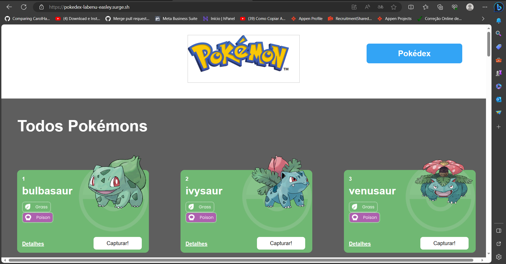
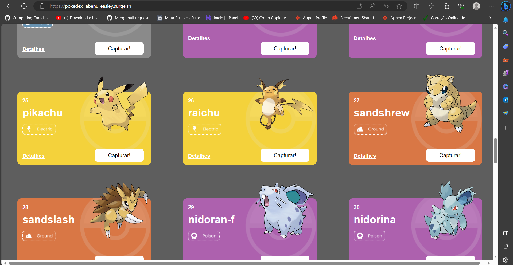
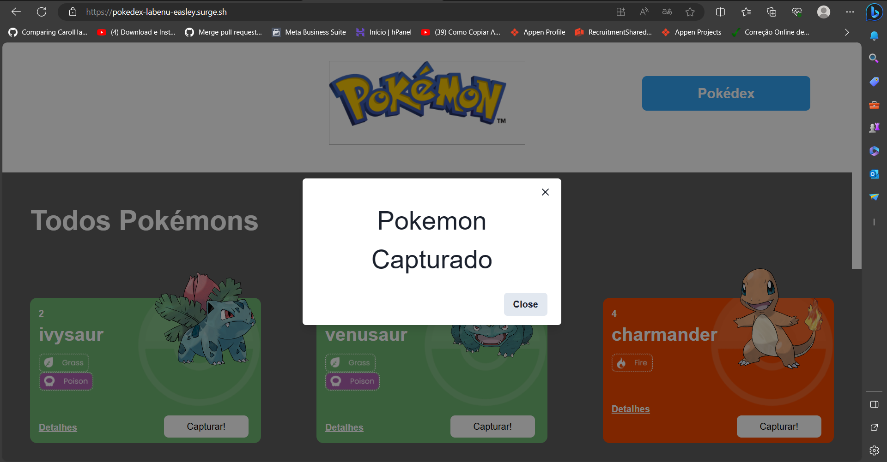
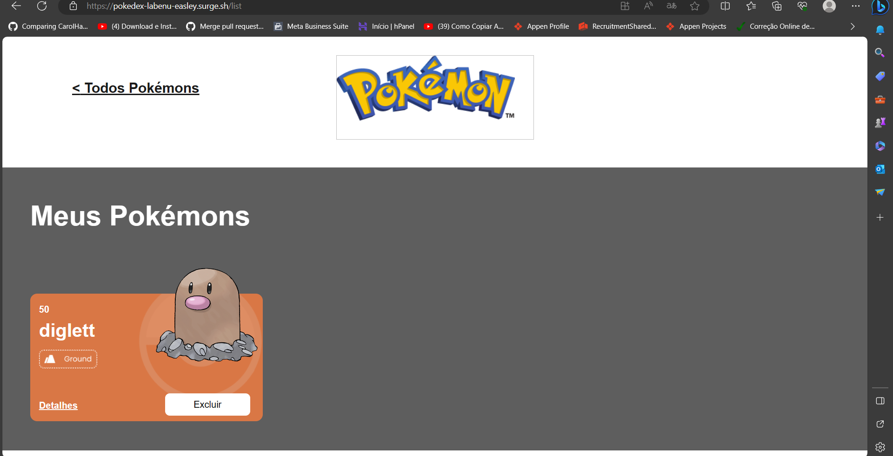
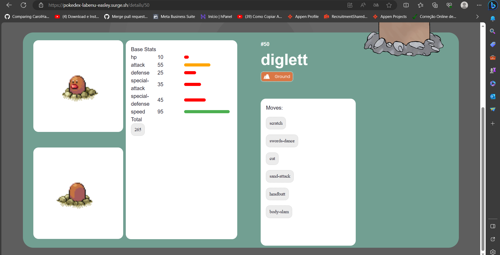

# **Projeto Pokedex React e API's**
O Projeto React e APIs é um site de pokémons que possui três páginas: Home, Pokedex e Detalhes. O projeto está subdivido em temas de acordo com os conteúdos que estudado durante o Módulo 2 - Frontend.

Este projeto terá como fonte de dados para a sua criação a [Poke Api](https://pokeapi.co/ "Poke Api"), uma Api pública, muito usada para aplicações focadas em aprendizado de programação e também usada em cases de processos seletivos.

Os conteúdos principais  a serem estudados são:

- Integração de APIs
- React Router
- Design Systems
- Estado Global

 

## Layout

## Demonstração
[Link do Projeto](https://pokedex-labenu-easley.surge.sh/ "Link do Porjeto")

## Tecnologias Utilizadas
1. React
2. JavaScript
3. React Router
4. Html
5. Css